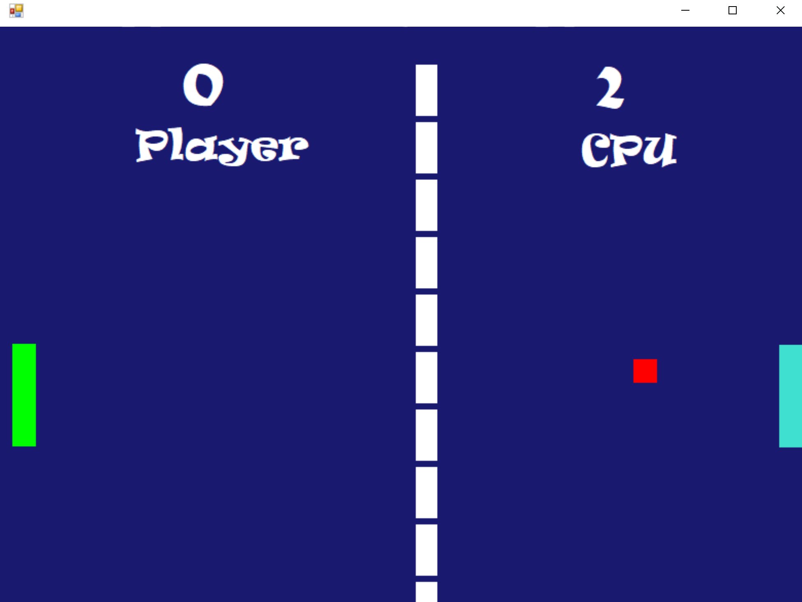

# Pong
Simple game of Pong programmed back in high school (2017). Responsible for back-end using C#. Front-end graphics was provided by course.

Game Features:
- Play against a worthy CPU opponent
- Games are up to a score of 5
- Ball moves faster as rally continues

Initial Load Screen:

Gameplay:

